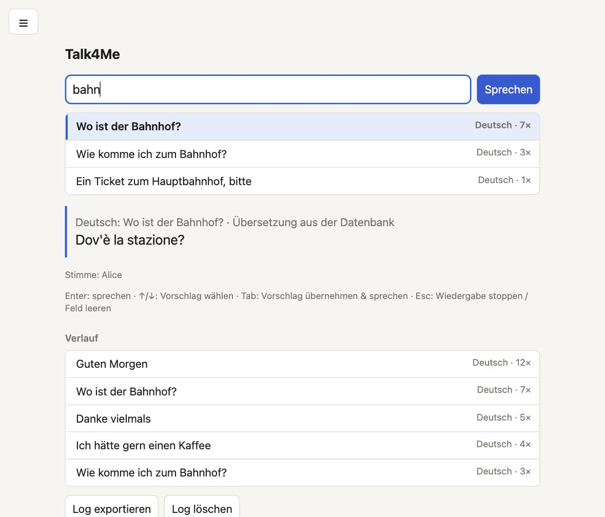

# Talk4Me

Type a sentence, hear it spoken. Sentences you have used before are remembered and suggested while you type, so you can repeat them with two key presses and no mouse. Optionally, the sentence is translated into German, English, Italian or French first.



*The screenshot shows demo data. The settings are hidden in the ☰ menu at the top left.*

## Features

- **Fuzzy suggestions while typing**, ranked by similarity plus a bonus for sentences used often and recently. With an empty input field, the 5 most recently used sentences are shown (each only once).
- **Keyboard only**: `↑`/`↓` select a suggestion, `Tab` speaks it, `Enter` speaks what you typed, `Esc` stops the playback (or clears the field when nothing is playing).
- **Translation** between German, English, Italian and French. Translations are stored and reused, in both directions (a stored translation also leads back to its original).
- **Settings in a hamburger menu** (top left of the web UI): they appear when you hover the ☰ button. Input and target language, male or female voice, German variant (Austria, Switzerland, Germany) and speed from 80 to 150 %.
- **One SQLite database** shared by the web UI and the terminal UI. Every sentence is stored once, with its language, first and last use date and use count.

## Requirements

- macOS (the terminal UI speaks through `say`)
- [uv](https://docs.astral.sh/uv/) with Python 3.13 or newer
- A browser for the web UI. No Python dependencies.

## Usage

### Web UI

```sh
uv run talk4me serve          # http://127.0.0.1:8765, opens the browser
uv run talk4me serve 9000     # another port
```

Open the page through this server. Opened as a plain file it cannot reach the database.

### Terminal UI

```sh
uv run talk4me                # default voice
uv run talk4me -v Anna        # choose a voice (list them with: say -v '?')
```

The terminal UI has the same suggestions and keys, but no translation and no voice settings beyond `-v`.

## Data

Everything is stored in `data/talk4me.db` (SQLite, excluded from git):

| Table | Content |
|---|---|
| `sentences` | one row per unique sentence: text, language, `first_used`, `last_used`, `use_count` |
| `translations` | `sentence_id` (foreign key to `sentences`), target language, translated text |

Inspect it with `sqlite3 data/talk4me.db "SELECT text, use_count FROM sentences"`.

## Good to know

- **Translation** uses the unofficial, keyless Google Translate endpoint from the browser. It may be throttled or blocked at any time; if it fails, the original sentence is spoken and a message is shown. Sentences are sent to Google only when input and target language differ and no stored translation exists.
- **Output device**: the browser's speech API speaks through the system's default output and cannot pick another device. Change it in macOS (Sound settings).
- **Voices** come from your system through the browser's Web Speech API, which does not report gender. The UI picks voices from name lists per language (`VOICES` in `src/talk4me/index.html`).
- **Austrian and Swiss voices** are not part of macOS. The browser Microsoft Edge offers them as online voices (Jonas and Ingrid for Austria, Jan and Leni for Switzerland). Without such a voice, the standard German voice is used and the page tells you so.

## Project layout

```
src/talk4me/__init__.py   terminal UI (curses) and entry point
src/talk4me/db.py         SQLite storage, translations, suggestion ranking
src/talk4me/server.py     local web server and JSON API
src/talk4me/index.html    web UI
```
